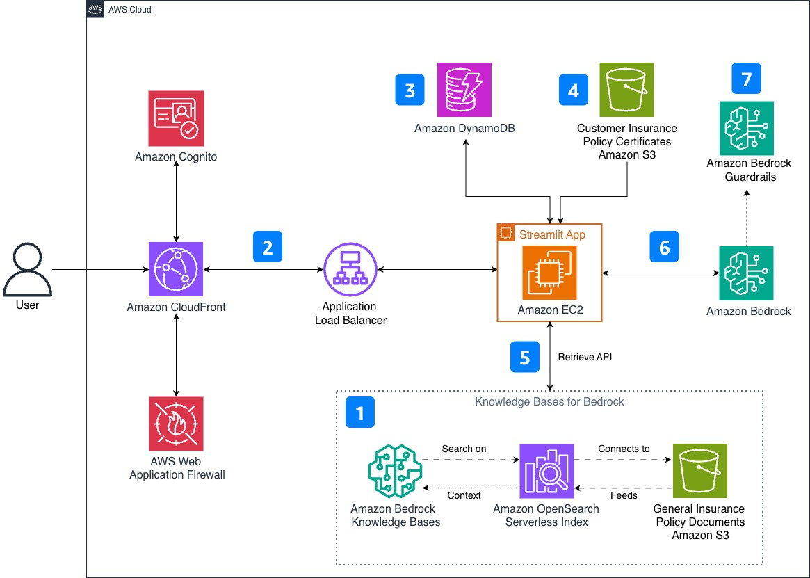

# Insurance Policy AI Assistant

## Overview

In today's fast-paced world, customers demand seamless and efficient experiences, especially when it comes to managing their insurance policies. Insurance providers can be on forefront of this revolution with the launch of customer facing intelligent AI Assistant that transform the way policyholders interact with their insurance providers. Leveraging the latest advancements in generative AI and natural language processing, this solution offers a user-friendly chat interface that understands complex policy documents and provides personalized, human-like responses tailored to each customer's unique needs. This enables customers to access accurate policy information, understand coverage details, and receive assistance 24/7, without the need for lengthy phone queues or tedious searches through policy documents.

## Core Features

 * Provides personalized responses to customer queries based on their policy coverage
 * Grounded with factual information using citations
 * Enable customers to easily understand their insurance coverage 
 * Quickly summarize and explain complex policy documents, terms and conditions
 * Assistant integrated with Guardrails to ensure security and quality of responses
 * Available 24x7 without human intervention and reduce call centre load

## Cost

This solution uses the following services: [Amazon Bedrock](https://aws.amazon.com/bedrock/pricing/), [Amazon Bedrock Knowledge Bases](https://aws.amazon.com/bedrock/pricing/), [Amazon Bedrock Guardrails](https://aws.amazon.com/bedrock/pricing/), [Amazon OpenSearch Serverless](https://aws.amazon.com/opensearch-service/pricing/), [Amazon S3](https://aws.amazon.com/s3/pricing/), [Amazon EC2](https://aws.amazon.com/ec2/pricing/), [Amazon CloudFront](https://aws.amazon.com/cloudfront/pricing/), [AWS WAF](https://aws.amazon.com/waf/pricing/), [Amazon Cognito](https://aws.amazon.com/cognito/pricing/), [Amazon DynamoDB](https://aws.amazon.com/dynamodb/pricing/), and [Application Load Balancer](https://aws.amazon.com/elasticloadbalancing/pricing/).

With an estimated usage of 8 hours (480 Amazon Bedrock requests with approximately 4,000 input tokens and 350 output tokens per request), **your total cost should not exceed $10**. Actual costs may be lower if you qualify for the [AWS Free Tier](https://aws.amazon.com/free/).

*We recommend creating a [Budget](https://aws.amazon.com/aws-cost-management/aws-budgets/) to help manage costs. Prices are subject to change. For full details, refer to the pricing webpage for each service used in this solution.*

### Sample Cost Table

The following table provides a sample cost breakdown for deploying this solution with the default parameters in US East (N. Virginia) with pricing as of August 29, 2025.

| AWS Service | Dimensions | Cost [USD] |
|---------|------------|------------|
| Amazon Bedrock (Claude 4.5 Haiku) | per 1,000 input tokens<br>per 1,000 output tokens | $0.0011<br>$0.0055 |
| Amazon OpenSearch Serverless | per OCU-hour for indexing<br>per OCU-hour for search<br>per GB-month of managed storage | $0.24<br>$0.24<br>$0.024 |
| Amazon S3 | per GB of storage used, Frequent Access Tier, first 50 TB per month<br>PUT, COPY, POST, LIST requests (per 1,000 requests)<br>GET, SELECT, and all other requests (per 1,000 requests) | $0.023<br>$0.005<br>$0.0004 |
| Amazon EC2 (t2.micro) | per On-Demand Linux instance hour<br>per GB-month of General Purpose (gp3) provisioned storage | $0.0116<br>$0.08 |
| Amazon DynamoDB | per GB-month of storage, over 25 GB<br>per million Write Request Units (WRU)<br>per million Read Request Units (RRU) | $0.25<br>$0.625<br>$0.125 |
| Amazon VPC | NAT Gateway per hour (1 per AZ, 2 total)<br>NAT Gateway data processing per GB | $0.045<br>$0.045 |


## Technical Architecture




1. **Knowledge Base Foundation:** Amazon Bedrock Knowledge Base ingests general, non-customer specific insurance policy documents from Amazon S3, generating embeddings using Amazon Titan Text Embeddings V2. This embedding model was chosen for its optimal balance of accuracy, cost-effectiveness, and native AWS integration — critical factors when processing high volumes of insurance documents. The embeddings are stored in Amazon OpenSearch Serverless for scalability and high performance vector similarity search. 

2. **Secure and Resilient Application Architecture:** Users access the Streamlit application through Amazon CloudFront, protected by AWS WAF against common web attacks. Amazon Cognito handles authentication, while Application Load Balancer distributes traffic to Amazon EC2 instance hosting the application.

3. **Session History:** Amazon DynamoDB captures session IDs and chat interactions. While not implemented in this solution, organizations can analyze this data to identify frequently asked questions, recognize customer interaction patterns, and drive continuous service improvements.

4. **Customer Document Management:** A customer’s insurance policy document is securely stored in Amazon S3 with a naming convention that matches the authenticated username. When a customer logs in through Amazon Cognito, the Streamlit application uses their username to retrieve the corresponding policy document from S3 (for example, user "john_doe" maps to "john_doe.txt"), ensuring each customer only accesses their own policy information and receives personalized responses based on their specific coverage details. This direct username-to-filename mapping simplifies the demonstration and helps readers understand the personalization concept. For production implementations, consider using more robust mapping mechanisms such as unique customer identifiers stored in a database or metadata service.

5. **Intelligent Query Processing:** When users ask questions, the application uses Amazon Bedrock Knowledge Base's Retrieve API to perform semantic search against the general insurance policy documents (pre-processed and stored as embeddings during initial setup). These documents contain terms, conditions, and coverage information applicable to all customers. The system identifies and retrieves the most relevant chunks based on the user's query.

6. **Personalized Response Generation:** Amazon Bedrock combines the retrieved knowledge base chunks with the customer's specific policy document (retrieved from S3 based on their authenticated username). Claude 3.5 Haiku processes this combined information to generate contextually accurate and personalized responses.

7. **Guardrails for Responsible AI:** Amazon Bedrock Guardrails helps implement responsible AI principles including safety, explainability, and fairness. The service applies multiple protection layers: blocking prompt injection attempts, filtering harmful content, verifying factual grounding against source documents and enforcing relevance thresholds. These controls work together to promote fair treatment of all users while maintaining explainable, trustworthy responses.

## Implementation Guide

### Important Note

* This project includes two AWS CDK stacks:

   * **`insurance_policy_ai_assistant_stack.py`** – Defines all core resources, including **Amazon Bedrock Knowledge Bases**, **Amazon S3**, **Amazon EC2**, **Amazon VPC** and **Amazon DynamoDB**.  
   * **`waf_stack.py`** – Defines the **Amazon Web Application Firewall (WAF)**.  
  > **Note:** To integrate WAF with **Amazon CloudFront**, it must be deployed in the **us-east-1 (N. Virginia)** region.  
  > All other resources can be deployed in your preferred AWS region.
* The general insurance policy documents are placed in the 'policy_docs' folder. These PDF documents contain the generic, [publicly available Insurance Policy terms and conditions](https://www.aviva.co.uk/insurance/motor/car-insurance1/), which are used for educational purposes. These documents are then used to train the Amazon Bedrock Knowledge Bases, based on which the AI Assistant provides responses. You are free to replace these documents with ones that are specific to your particular use case.
* The customer-specific policy document are placed in the 'customer_policy' folder. These are private policy documents that are personal to the customer and contain confidential information. For this demo, we are assuming two fictional customers, John Doe and John Smith.
* Once the CDK is deployed, you will receive the Amazon Cognito User Pool ID as an output. You must then create users (john_doe and john_smith) for the corresponding user pool ID through Amazon Cognito from the AWS console. Detailed guidance can be found in the [provided documentation](https://docs.aws.amazon.com/cognito/latest/developerguide/how-to-create-user-accounts.html).
* Ensure that the username is 'john_doe' and 'john_smith', and there are no typos. This is because the solution can only fetch the corresponding customer policy from the S3 bucket if the username matches the customer policy file name. If you would like to change or add any other user names, ensure you update that in the 'customer_policy' folder as well. Ultimately, the username and the customer policy file name (without the extention .txt) should be the same for this solution to work properly.
* To modify the Streamlit Application code, update the system prompt, or make other adjustments, edit the 'user_data_script.sh' file. The Amazon EC2 instance will execute this script during its initial boot process.
* The LLM model used by the Amazon Bedrock KB and AI Assistant is specified in the 'app.py' file. For this demo, Anthropic's Claude 4.5 Haiku model is used. If you would like to test it out with any other LLM's, you can change the 'model_id' variable in the 'app.py' file. You can get all the available Amazon Bedrock base model IDs [here](https://docs.aws.amazon.com/bedrock/latest/userguide/model-ids.html).

### Pre-requisites

 * You should have docker installed on your local machine. More details in [here](https://docs.docker.com/desktop/).
 * If deploying to any region other than us-east-1 (N. Virginia), remember to update the CloudFront prefix list in the 'app.py' file accordingly.
 ```
 ap-northeast-1:
   PrefixList: pl-58a04531
 ap-northeast-2:
   PrefixList: pl-22a6434b
 ap-south-1:
   PrefixList: pl-9aa247f3
 ap-southeast-1:
   PrefixList: pl-31a34658
 ap-southeast-2:
   PrefixList: pl-b8a742d1
 ca-central-1:
   PrefixList: pl-38a64351
 eu-central-1:
   PrefixList: pl-a3a144ca
 eu-north-1:
   PrefixList: pl-fab65393
 eu-west-1:
   PrefixList: pl-4fa04526
 eu-west-2:
   PrefixList: pl-93a247fa
 eu-west-3:
   PrefixList: pl-75b1541c
 sa-east-1:
   PrefixList: pl-5da64334
 us-east-1:
   PrefixList: pl-3b927c52
 us-east-2:
   PrefixList: pl-b6a144df
 us-west-1:
   PrefixList: pl-4ea04527
 us-west-2:
   PrefixList: pl-82a045eb
```
### CDK Deployment


Manually create a virtualenv on MacOS and Linux:

```
python3 -m venv .venv
```

After the init process completes and the virtualenv is created, you can use the following
step to activate your virtualenv.

```
source .venv/bin/activate
```

If you are a Windows platform, you would activate the virtualenv like this:

```
% .venv\Scripts\activate.bat
```

Once the virtualenv is activated, you can install the required dependencies.

```
pip3 install -r requirements.txt
```

Ensure your CDK version is up-to-date.

```
npm install -g aws-cdk
```

If you are deploying CDK for the first time in your account, run the below command (if not, skip this step):

```
cdk bootstrap
```

At this point you can now synthesize the CloudFormation template for this code.

```
cdk synth
```

You can now deploy the CDK stacks:

```
cdk deploy --all
```

You will need to enter 'y' to confirm the deployment. The deployment can take around 15-20 minutes to complete. Once completed, you will see the Amazon Cloudfront URL displayed as an output which you can access in the web browser to view the Insurance Policy AI Assistant Streamlit App. 

You will also see the Amazon Cognito User Pool ID as an output. You must then create users (john_doe and john_smith) for the corresponding user pool ID through Amazon Cognito from the AWS console. Detailed guidance can be found in the [provided documentation](https://docs.aws.amazon.com/cognito/latest/developerguide/how-to-create-user-accounts.html). Ensure that the username is 'john_doe' and 'john_smith', and there are no typos. This is because the solution can only fetch the corresponding customer policy from the S3 bucket if the username matches the customer policy file name. If you would like to change or add any other user names, ensure you update that in the 'customer_policy' folder as well. For example, if you want to create a new user, say, 'michael_scott', there should be a 'michael_scott.txt' file under 'customer_policy' folder with relevant policy details. Ultimately, for any user, the username and the customer policy file name (without the extention .txt) should be the same for this solution to work properly.


If you no longer need the application or would like to delete the CDK deployment, run the following command:

Note: All the created resources and data will be deleted. Ensure you take backups if required.

```
cdk destroy --all
```

## Troubleshooting

- **Region selection:** Verify that you’ve selected the correct AWS region in the console. If no resources appear, switch to the region where they were deployed.  
- **CDK destroy issues:** If `cdk destroy --all` fails, open the **CloudFormation console** and check the **Events** tab for error details.  
- **WAF stack:** The `waf_stack` is deployed in **us-east-1**. Switch to this region to view the CloudFormation stack and WAF rules.  
- **Docker errors:** If deployment fails with Docker-related errors, ensure **Docker is installed and running** on your machine.


## Security

See [CONTRIBUTING](CONTRIBUTING.md#security-issue-notifications) for more information.

## License

This library is licensed under the MIT-0 License. See the LICENSE file.